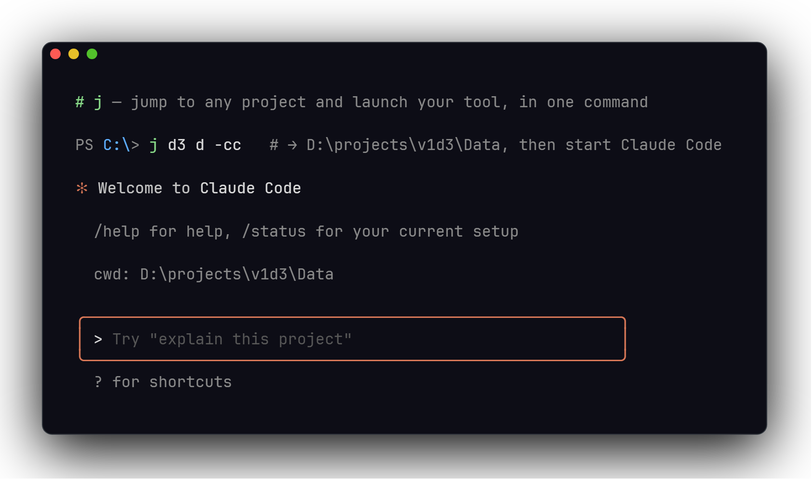

# j — 确定性目录书签工具

[English](README.md)

<p align="center">
  
</p>

J 是一个面向 Windows 和 macOS shell（PowerShell / cmd / zsh / bash / sh）的确定性目录书签工具。定义一次项目路径，之后用简短、可预测的命令跳转。与 zoxide、autojump 等基于历史的工具不同，J 不学习、不猜测——它只管理你明确命名的路径。单文件可执行，无依赖。

## 安装

### 下载预编译版本

[Releases 页面](https://github.com/SiskonEmilia/J/releases) 提供 **Windows** 和 **macOS** 预编译二进制：

- `j-{version}-x86_64-pc-windows-msvc.exe`
- `j-{version}-aarch64-apple-darwin`

把二进制放到稳定目录（Windows：`C:\tools\j\j.exe`，macOS：`/usr/local/bin/j`），然后安装 shim：

```powershell
# Windows (PowerShell)
C:\tools\j\j.exe :install powershell
```

```cmd
rem Windows (cmd)
C:\tools\j\j.exe :install cmd
```

```sh
# macOS
/usr/local/bin/j :install zsh       # ~/.zshrc
/usr/local/bin/j :install bash      # ~/.bashrc
```

- **PowerShell**：同时写入 `WindowsPowerShell`（5.1）和 `PowerShell`（7+）两个 profile。
- **cmd**：在 `%USERPROFILE%\.config\j\bin\` 生成 `j.bat`，并将该目录加入用户 PATH。
- **zsh / bash**：写入 shim 函数 + Tab 补全到 profile。`:install zsh` 同时注册 `compdef _j j`；`:install bash` 同时注册 `complete -F _j_complete_bash j`。
- **sh**：写入 shim 到 `~/.profile`（无补全）。

新开终端即可使用。

> **Tip**: 安装时二进制文件的绝对路径会被写入 shim 内部。如果移动了二进制文件，需要重新执行 `:install`。

也可以用 `:init <shell>` 将 shim 脚本打印到 stdout，手动嵌入。

### 从源码构建

```sh
cargo build --release
# 产物：target/release/j  (macOS)  或  target/release/j.exe  (Windows)
```

## 配置

配置文件位置：Windows 为 `%USERPROFILE%\.config\j\config.jsonc`，macOS 为 `~/.config/j/config.jsonc`（可用 `J_CONFIG` 环境变量覆盖）。

```jsonc
{
  // 全局扁平命令别名；调用时 -<name> 会在跳转后执行 "<cmd>" 并追加透传参数
  "commands": {
    "c":  "code",
    "o":  "open .",
    "g":  "git status"
  },

  // 可复用的路径模板；模板及其子节点的 children 里不能再 mixin 其他模板
  "templates": {
    "uProject": {
      "children": {
        "d":   { "path": "Data" },
        "sd":  { "path": "Shared/Data" },
        "src": {
          "path": "Source",
          "children": {
            "pri": { "path": "Private" },
            "pub": { "path": "Public" }
          }
        }
      }
    }
  },

  // 跳转根。path 必须绝对（POSIX 或 Windows 风格皆可）
  "roots": {
    "proj": {
      "path": "/Users/me/projects/myproject",
      // Windows 上: "path": "C:\\projects\\myproject",
      "templates": ["uProject"],
      "children": {
        "notes": { "path": "docs/notes" }
      }
    }
  }
}
```

合并语义：节点的 `children` 视图 = `templates` 按数组顺序依次展开 → 节点自身 children 覆盖。同名子符号：多个模板之间后者赢，节点自身赢模板；非叶节点深合并。`:list` 输出中模板来源的符号会标注 `(template_name)`。

## 用法

```
j proj                      # 跳到 proj 根目录
j proj d                    # → proj/Data（d 来自 uProject 模板）
j proj src pri              # → proj/Source/Private
j proj -c                   # cd 后执行 `code`
j proj -c --new-window      # 等效 `code --new-window`（别名后参数原样透传）
j -c --new-window           # 在当前目录执行 `code --new-window`
j                           # 显示帮助（等同 j :help）
j --help                    # 同上
j --version                 # 显示版本号
j :tpl-dump proj sharedTpl  # 将 proj 的合并 children 封装成模板
j :tpl-apply proj2 sharedTpl # 将 sharedTpl 挂到另一 root
```

### Tab 补全

**PowerShell**：补全根名、子命令、子符号、别名、`:add` 路径段。首 token 精确匹配根名时展开子符号。`:add` 先匹配符号再回退到子目录。

**zsh / bash**：`:install zsh` / `:install bash` 时自动安装。覆盖根名、子符号、冒号子命令、别名、`install/uninstall/init` 的 shell 名、`:add` 目录回退。

### 别名中的引号

别名命令支持类 shell 的引号处理（单引号、双引号、反斜杠转义）：

```jsonc
"commands": {
  "vsc": "open -a \"Visual Studio Code\"",
  "echo": "echo 'hello world'",
  "path": "ls /Users/me/My\\ Documents"
}
```

### 子命令（冒号前缀，避免和 root 命名冲突）

```
j :list [<root> [<sym>...]]                     # 树形打印（合并视图，模板来源标注）；无参打印全部
j :add <root> [<sym>...] <path>                 # 新增/覆写节点；只传 <root> <absPath> = 新增 root
j :add <root> .                                 # 将当前目录记为 root
j :rm <root> [<sym>...]                         # 删除节点或 root
j :alias <name> <command>                       # 设置别名
j :alias --rm <name>                            # 删除别名
j :tpl-dump [--force] <root> [<sym>...] <tpl>   # 导出合并 children 为模板
j :tpl-apply <root> [<sym>...] <tpl>            # 挂模板到已有节点
j :tpl-rm [--force] <tpl>                       # 删除模板
j :edit                                         # 用 $EDITOR 打开配置
j :check                                        # 校验所有路径存在
j :config-path                                  # 打印配置文件路径
j :install   <shell> [--profile <path>]         # 幂等写入 shim
j :uninstall <shell> [--profile <path>]         # 反向移除
j :init      <shell>                            # 打印 shim 脚本到 stdout
j :help | --help | -h                           # 显示帮助
j :version | --version                          # 显示版本号
```

POSIX shell 可用 `--profile` 指定自定义 profile：

```sh
j :install zsh --profile ~/.my_custom_zshrc
```

## 卸载

```powershell
# Windows
C:\tools\j\j.exe :uninstall powershell
C:\tools\j\j.exe :uninstall cmd
```

```sh
# macOS
/usr/local/bin/j :uninstall zsh
```

## 常见问题

| 现象 | 解决方法 |
|-----|---------|
| `command not found: j` | 确保二进制文件在 PATH 稳定目录中，或先安装 shim |
| shim 未加载 | 打开新终端；确认对应的 profile 文件被 source |
| 移动二进制文件后失效 | 重新执行 `:install`——shim 中写入了绝对路径 |
| Tab 补全不生效 | `:install` 后新开 shell；zsh 下确保 `compinit` 正常运行 |

### 已知限制

- POSIX shell 无 PowerShell 交互式候选 UI（直接运行 `j` 无参数会显示帮助）。
- 别名命令在 Rust 端做词法分析后发射，不会在 shell 中 `eval`。

## 工程说明

- Rust 2021 edition，单文件二进制，启动 <10ms。
- 核心纯函数式：argv + config → 发射目标 shell 脚本到 stdout，shim eval 之。
- 配置手写友好（JSONC，保留注释和键顺序的 CST 回写）。

### 退出码

| 码 | 含义 |
|----|------|
| 0  | 成功 |
| 1  | 内部错误 |
| 2  | 未找到（root / symbol / alias） |
| 3  | 配置错误 |
| 4  | 安装错误 |

### 运行测试

```sh
cargo test                                   # unit + integration tests
cmd.exe /c scripts/integration.bat           # cmd shim smoke test (Windows)
powershell -File scripts/integration.ps1     # PowerShell shim smoke test (Windows)
bash scripts/e2e-macos.sh                    # POSIX E2E smoke test (macOS)
```

## License

本项目使用 [GNU General Public License v3.0](LICENSE)。
